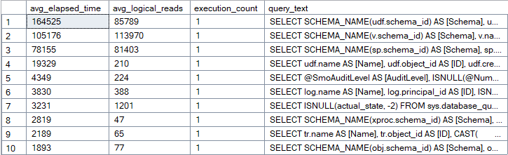
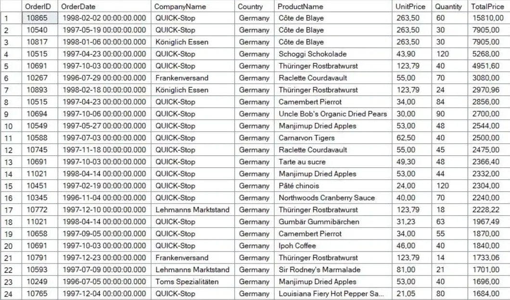
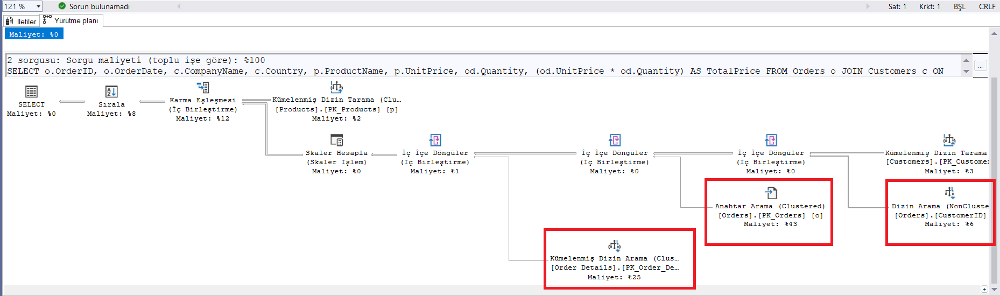
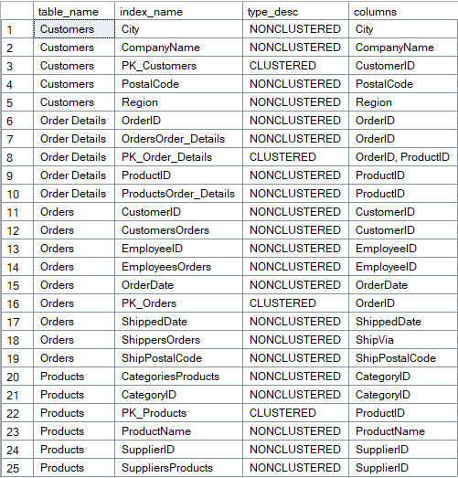
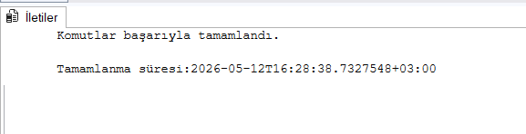
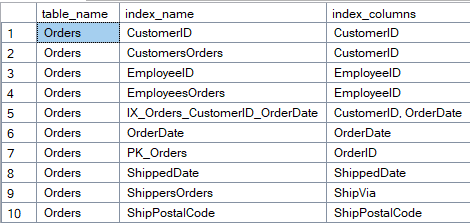
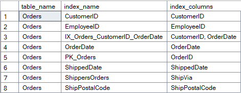
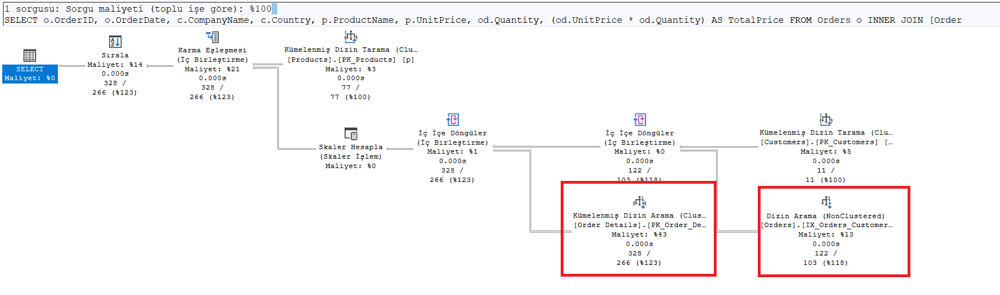

# 3. Performans Optimizasyonu

Genel 3, Final 1. Proje

Ağ Tabanlı Paralel Dağıtım Sistemleri dersi için yapılan Performans Optimizasyonu projesi.

# BLM 4522 PROJE RAPORU 

Zeynep Hacısalihoğlu

22290449

## İçindekiler

## İçindekiler

- [1. Giriş](#1-giriş)
  - [1.1 Amaç ve Kapsam](#11-amaç-ve-kapsam)
  - [1.2 Kullanılan Ortam](#12-kullanılan-ortam)
  - [1.3 Veri Tabanı Kurulumu](#13-veri-tabanı-kurulumu)
- [2. Performans İzleme](#2-performans-i̇zleme)
  - [2.1 DMV ile Sorgu Performansının İzlenmesi](#21-dmv-ile-sorgu-performansının-i̇zlenmesi)
  - [2.2 Test Sorgusu Oluşturulması](#22-test-sorgusu-oluşturulması)
  - [2.3 Execution Plan Analizi](#23-execution-plan-analizi)
- [3. Index Yönetimi](#3-index-yönetimi)
  - [3.1 Mevcut Indexlerin İncelenmesi](#31-mevcut-indexlerin-i̇ncelenmesi)
  - [3.2 Composite Index Oluşturulması](#32-composite-index-oluşturulması)
  - [3.3 Gereksiz Index Tespiti ve Silinmesi](#33-gereksiz-index-tespiti-ve-silinmesi)
- [4. Sorgu Optimizasyonu](#4-sorgu-optimizasyonu)
  - [4.1 Sorgunun İyileştirilmesi](#41-sorgunun-i̇yileştirilmesi)
  - [4.2 Execution Plan Karşılaştırması](#42-execution-plan-karşılaştırması)
- [5. Sonuç](#5-sonuç)


# 1.	Giriş

Bu proje kapsamında Microsoft SQL Server 2022 üzerinde çalışan Northwind veritabanında performans analizi ve optimizasyon çalışmaları gerçekleştirilmiştir. Dynamic Management Views (DMV) aracılığıyla sistem izlenmiş, Execution Plan analiziyle darboğazlar tespit edilmiş; index yönetimi ve sorgu iyileştirme teknikleriyle bu sorunlar giderilmiştir.

## 1.1 Amaç ve Kapsam

Çalışmanın temel amacı veritabanı sorgularını izleyerek darboğazları tespit etmek ve index yönetimi ile sorgu iyileştirme teknikleri aracılığıyla sistem performansını artırmaktır.

Bu doğrultuda aşağıdaki adımlar uygulanmıştır:

1.	DMV kullanılarak mevcut sorgu performansı izlenmiştir.
2.	Test sorgusu oluşturularak Execution Plan analizi yapılmıştır.
3.	Mevcut indexler incelenmiş, eksik ve gereksiz indexler tespit edilmiştir.
4.	Composite index oluşturularak yüksek maliyetli Anahtar Arama operasyonu ortadan kaldırılmıştır.
5.	Duplicate indexler silinerek index yapısı sadeleştirilmiştir.
6.	Sorgu yapısı iyileştirilerek erken filtreleme sağlanmıştır.


## 1.2	Kullanılan Ortam

-  Veritabanı Sistemi: Microsoft SQL Server 2022 Developer Edition, Sürüm 16.0.1000.6 
-  Yönetim Aracı: SQL Server Management Studio (SSMS) 

## 1.3	Veri Tabanı Kurulumu

Proje kapsamında kullanılacak örnek veritabanı olarak Northwind seçilmiştir. Northwind, Microsoft tarafından yayımlanmış; bir ticaret şirketinin sipariş, ürün, müşteri ve çalışan verilerini barındıran klasik bir örnek veritabanıdır. Veritabanı SSMS üzerinden başarıyla yüklenmiş ve önceki projelerde doğrulanmıştır.


## 2. Performans İzleme

## 2.1 DMV ile Sorgu Performansının İzlenmesi

Sistemde çalışan sorguların performans verilerini incelemek amacıyla sys.dm_exec_query_stats ve sys.dm_exec_sql_text Dynamic Management View'ları kullanılmıştır. Bu görünümler; sorguların ortalama çalışma süresi, mantıksal okuma sayısı ve çalıştırılma sayısı gibi bilgileri sunmaktadır.

Aşağıdaki sorgu ile sisteme en fazla yük bindiren ilk 10 sorgu listelenmiştir:

```sql
SELECT TOP 10
    qs.total_elapsed_time / qs.execution_count AS avg_elapsed_time,
    qs.total_logical_reads / qs.execution_count AS avg_logical_reads,
    qs.execution_count,
    SUBSTRING(qt.text, (qs.statement_start_offset/2)+1,
        ((CASE qs.statement_end_offset
            WHEN -1 THEN DATALENGTH(qt.text)
            ELSE qs.statement_end_offset
        END - qs.statement_start_offset)/2)+1) AS query_text
FROM sys.dm_exec_query_stats qs
CROSS APPLY sys.dm_exec_sql_text(qs.sql_handle) qt
ORDER BY avg_elapsed_time DESC;
```

Sorgu çalıştırıldığında dönen sonuçlar incelenmiş; listenin büyük bölümünün SSMS'in kendi iç sorgularından oluştuğu görülmüştür. Northwind veritabanına henüz yeterli yük binmediğinden bu sonuç beklenen bir durumdur.



## 2.2	Test Sorgusu Oluşturulması

Northwind veritabanı üzerinde anlamlı performans verisi elde edebilmek için birden fazla tabloyu birleştiren ve filtreleme içeren bir test sorgusu oluşturulmuştur. Sorgu; Orders, Customers, Order Details ve Products tablolarını JOIN ile birleştirerek Almanya'ya ait siparişleri listelemektedir.

```sql
SELECT o.OrderID, o.OrderDate, c.CompanyName, c.Country,
       p.ProductName, p.UnitPrice, od.Quantity,
       (od.UnitPrice * od.Quantity) AS TotalPrice
FROM Orders o
JOIN Customers c ON o.CustomerID = c.CustomerID
JOIN [Order Details] od ON o.OrderID = od.OrderID
JOIN Products p ON od.ProductID = p.ProductID
WHERE c.Country = 'Germany'
  AND o.OrderDate BETWEEN '1996-01-01' AND '1998-12-31'
ORDER BY TotalPrice DESC;
```

Sorgu başarıyla çalıştırılmış ve Almanya'ya ait siparişler toplam fiyata göre sıralanmış şekilde listelenmiştir. 



## 2.3 Execution Plan Analizi

Sorgunun kaynak kullanımını ayrıntılı incelemek amacıyla SSMS üzerinden Actual Execution Plan etkinleştirilmiş ve sorgu tekrar çalıştırılmıştır. Plan incelendiğinde aşağıdaki kritik operasyonlar tespit edilmiştir:

    •	Anahtar Arama (Clustered) — Maliyet: %43: Orders tablosunda mevcut index ihtiyaç duyulan tüm kolonları karşılamadığından SQL Server ana tabloya geri dönmek zorunda kalmaktadır. Bu operasyon planın en pahalı adımını oluşturmaktadır.

    •	Kümelenmiş Dizin Tarama — Maliyet: %25: Order Details tablosunda index araması yerine tam tarama yapılmaktadır.

    •	Dizin Arama (NonClustered) — Maliyet: %6: Orders tablosundaki CustomerID indexi kullanılmış ancak tek başına yeterli olmamıştır.




## 3. Index Yönetimi

## 3.1 Mevcut Indexlerin İncelenmesi

Execution Plan analizinin ardından Orders, Customers, Order Details ve Products tablolarındaki mevcut index yapısı sorgulanmıştır.

```sql
SELECT 
    t.name AS table_name,
    i.name AS index_name,
    i.type_desc,
    STRING_AGG(c.name, ', ') AS columns
FROM sys.indexes i
JOIN sys.index_columns ic ON i.object_id = ic.object_id AND i.index_id = ic.index_id
JOIN sys.columns c ON ic.object_id = c.object_id AND ic.column_id = c.column_id
JOIN sys.tables t ON i.object_id = t.object_id
WHERE t.name IN ('Orders', 'Customers', 'Order Details', 'Products')
GROUP BY t.name, i.name, i.type_desc
ORDER BY t.name, i.name;
```

Sonuçlar incelendiğinde Orders tablosunda CustomerID ve CustomersOrders adlı iki ayrı indexin aynı kolonu kapsadığı, benzer şekilde EmployeeID ve EmployeesOrders indexlerinin de birbirini tekrar ettiği tespit edilmiştir. 




## 3.2 Composite Index Oluşturulması

Execution Plan'da %43 maliyet üreten Anahtar Arama operasyonunu ortadan kaldırmak amacıyla CustomerID ve OrderDate kolonlarını birleştiren, sık kullanılan diğer kolonları INCLUDE eden bir composite index oluşturulmuştur.

```sql
CREATE NONCLUSTERED INDEX IX_Orders_CustomerID_OrderDate
ON Orders (CustomerID, OrderDate)
INCLUDE (OrderID, EmployeeID, ShipVia);
```

Bu sayede SQL Server, sorgu sırasında ihtiyaç duyduğu tüm kolonlara doğrudan index üzerinden erişebilmekte; ana tabloya geri dönme ihtiyacı ortadan kalkmaktadır.




## 3.3 Gereksiz Index Tespiti ve Silinmesi

Mevcut index listesi incelendiğinde Orders tablosunda birbirini tekrar eden indexler tespit edilmiştir:

    • CustomerID ve CustomersOrders → her ikisi de yalnızca CustomerID kolonunu kapsamaktadır.
    • EmployeeID ve EmployeesOrders → her ikisi de yalnızca EmployeeID kolonunu kapsamaktadır.

Duplicate indexler gereksiz disk alanı tüketmekte ve her INSERT/UPDATE işleminde ek maliyet oluşturmaktadır. Bu nedenle tekrar eden indexler aşağıdaki sorgu ile silinmiştir:

```sql
DROP INDEX CustomersOrders ON Orders;
DROP INDEX EmployeesOrders ON Orders;
```

Silme işleminin ardından index listesi tekrar sorgulanmış ve Orders tablosundaki index sayısının 10'dan 8'e düştüğü doğrulanmıştır. 





## 4. Sorgu Optimizasyonu

## 4.1 Sorgunun İyileştirilmesi

Test aşamasında kullanılan orijinal sorguda WHERE koşulu içinde yer alan c.Country = 'Germany' filtresi, JOIN işlemleri tamamlandıktan sonra uygulanmaktadır. Bu durum SQL Server'ın gereksiz satırları işlemesine neden olmaktadır.

Filtrenin JOIN koşuluna taşınmasıyla SQL Server, Customers tablosunu daha erken aşamada filtreleyerek sonraki JOIN işlemlerini daha az satır üzerinde gerçekleştirebilmektedir.

```sql
SELECT o.OrderID, o.OrderDate, c.CompanyName, c.Country,
       p.ProductName, p.UnitPrice, od.Quantity,
       (od.UnitPrice * od.Quantity) AS TotalPrice
FROM Orders o
INNER JOIN [Order Details] od ON o.OrderID = od.OrderID
INNER JOIN Customers c ON o.CustomerID = c.CustomerID AND c.Country = 'Germany'
INNER JOIN Products p ON od.ProductID = p.ProductID
WHERE o.OrderDate BETWEEN '1996-01-01' AND '1998-12-31'
ORDER BY TotalPrice DESC;
```

## 4.2 Execution Plan Karşılaştırması

Optimize edilmiş sorgunun Execution Plan'ı incelendiğinde Anahtar Arama operasyonunun tamamen ortadan kalktığı görülmüştür. Composite index sayesinde SQL Server artık ihtiyaç duyduğu tüm kolonlara doğrudan index üzerinden erişmektedir.

| Operasyon | Öncesi | Sonrası |
|---|---|---|
| Anahtar Arama (Clustered) | %43 | Yok |
| Dizin Arama (NonClustered) | %6 | Doğrudan kullanıyor |
| Genel plan karmaşıklığı | Yüksek | Düşük |



## 5.	Sonuç

Bu proje kapsamında Northwind veritabanı üzerinde performans analizi ve optimizasyon çalışmaları gerçekleştirilmiştir. Yapılan çalışmalar sonucunda aşağıdaki iyileştirmeler sağlanmıştır:

    •	DMV kullanılarak sistem genelinde sorgu performansı izlenmiş ve analiz edilmiştir.
    •	Execution Plan incelemesiyle %43 maliyet üreten Anahtar Arama operasyonu tespit edilmiştir.
    •	Oluşturulan composite index sayesinde bu operasyon tamamen ortadan kaldırılmıştır.
    •	Duplicate indexlerin silinmesiyle Orders tablosundaki index yapısı sadeleştirilmiş, gereksiz kaynak tüketimi önlenmiştir.
    •	Sorgu yapısının iyileştirilmesiyle erken filtreleme sağlanmış ve SQL Server'ın daha az satır üzerinde çalışması mümkün kılınmıştır.

Çalışma boyunca SQL Server'ın sunduğu DMV'ler ve Execution Plan aracının performans sorunlarının tespitinde ne denli etkili olduğu görülmüştür.


