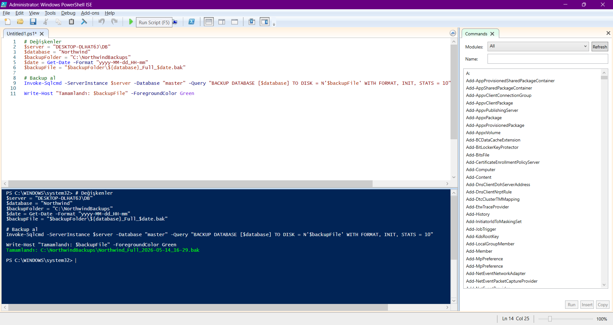
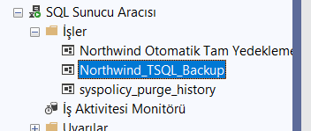
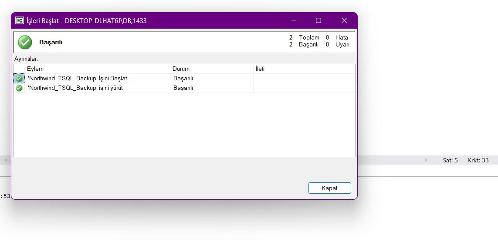
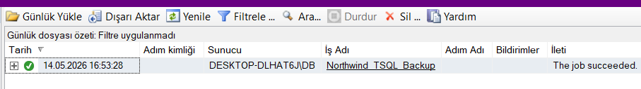
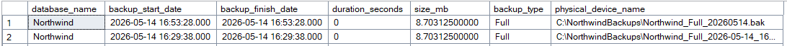
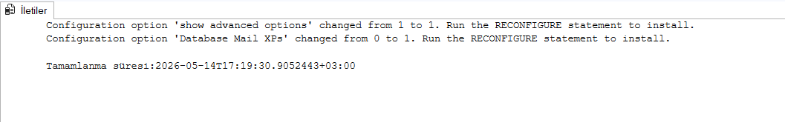
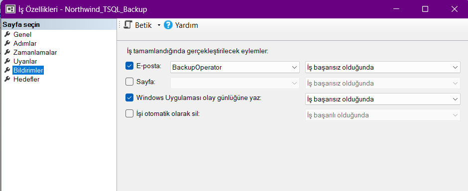

# Veritabanı Yedekleme ve Otomasyon Çalışması

Genel 4, Final 2. Proje

Ağ Tabanlı Paralel Dağıtım Sistemleri dersi için yapılan Veritabanı Yedekleme ve Otomasyon Çalışması projesi.

# BLM 4522 PROJE RAPORU 

Zeynep Hacısalihoğlu

22290449

## İçindekiler

- [1. Giriş](#1-giriş)
  - [1.1 Amaç ve Kapsam](#11-amaç-ve-kapsam)
  - [1.2 Kullanılan Ortam](#12-kullanılan-ortam)
  - [1.3 Veri Tabanı Kurulumu](#13-veri-tabanı-kurulumu)
- [2. PowerShell ile Otomatik Yedekleme](#2-powershell-ile-otomatik-yedekleme)
  - [2.1 PowerShell Scriptinin Hazırlanması ve Çalıştırılması](#21-powershell-scriptinin-hazırlanması-ve-çalıştırılması)
- [3. SQL Server Agent ile Zamanlama](#3-sql-server-agent-ile-zamanlama)
  - [3.1 T-SQL ile Job Oluşturulması](#31-t-sql-ile-job-oluşturulması)
  - [3.2 Job'un Doğrulanması ve Test Edilmesi](#32-jobun-doğrulanması-ve-test-edilmesi)
- [4. T-SQL ile Yedekleme Raporu](#4-t-sql-ile-yedekleme-raporu)
  - [4.1 Yedekleme Geçmişinin Raporlanması](#41-yedekleme-geçmişinin-raporlanması)
- [5. Otomatik Uyarı Sistemi](#5-otomatik-uyarı-sistemi)
  - [5.1 Database Mail Yapılandırması](#51-database-mail-yapılandırması)
  - [5.2 Operator Tanımlanması ve Job Bildirimi](#52-operator-tanımlanması-ve-job-bildirimi)
- [6. Sonuç](#6-sonuç)


# 1.	Giriş

Bu proje kapsamında Microsoft SQL Server 2022 üzerinde çalışan Northwind veritabanı için yedekleme işlemleri PowerShell scripting ve SQL Server Agent kullanılarak otomatikleştirilmiştir. Yedekleme süreçlerinin izlenebilmesi için T-SQL ile raporlama yapılmış ve başarısız yedeklemeler için otomatik uyarı mekanizması kurulmuştur.

## 1.1 Amaç ve Kapsam

Çalışmanın temel amacı veritabanı yedekleme işlemlerini otomatikleştirerek yönetim süreçlerini optimize etmek ve yedeklerin düzenli alındığını doğrulamak için denetim ve raporlama mekanizmaları kurmaktır.

Bu doğrultuda aşağıdaki adımlar uygulanmıştır:

  •	PowerShell scripti ile otomatik yedekleme gerçekleştirilmiştir.
  •	SQL Server Agent ile yedekleme işleri zamanlanmıştır.
  •	T-SQL ile yedekleme geçmişi raporlanmıştır.
  •	Başarısız yedeklemeler için otomatik uyarı sistemi kurulmuştur.


## 1.2	Kullanılan Ortam

  Veritabanı Sistemi: Microsoft SQL Server 2022 Developer Edition, Sürüm 16.0.1000.6
  Yönetim Aracı: SQL Server Management Studio (SSMS)
  Scripting Aracı: Windows PowerShell ISE

## 1.3	Veri Tabanı Kurulumu

Proje kapsamında kullanılacak örnek veritabanı olarak Northwind seçilmiştir. Northwind, Microsoft tarafından yayımlanmış; bir ticaret şirketinin sipariş, ürün, müşteri ve çalışan verilerini barındıran klasik bir örnek veritabanıdır. Veritabanı SSMS üzerinden başarıyla yüklenmiş ve önceki projelerde doğrulanmıştır.


## 2. PowerShell ile Otomatik Yedekleme

## 2.1 PowerShell Scriptinin Hazırlanması ve Çalıştırılması

Yedekleme işlemini otomatikleştirmek amacıyla Windows PowerShell ISE kullanılarak bir script hazırlanmıştır. Script; Northwind veritabanının Full Backup'ını alarak C:\NorthwindBackups klasörüne tarih damgalı şekilde kaydetmektedir.

```powershell
# Değişkenler
$server = "DESKTOP-DLHAT6J\DB"
$database = "Northwind"
$backupFolder = "C:\NorthwindBackups"
$date = Get-Date -Format "yyyy-MM-dd_HH-mm"
$backupFile = "$backupFolder\${database}_Full_$date.bak"

# Backup al
Invoke-Sqlcmd -ServerInstance $server -Database "master" -Query "BACKUP DATABASE [$database] TO DISK = N'$backupFile' WITH FORMAT, INIT, STATS = 10"

Write-Host "Tamamlandı: $backupFile" -ForegroundColor Green
```

Script başarıyla çalıştırılmış ve Northwind_Full_2026-05-14_16-29.bak adlı yedek dosyası oluşturulmuştur. Dosyanın klasörde oluştuğu doğrulanmıştır.




## 3. SQL Server Agent ile Zamanlama

## 3.1 T-SQL ile Job Oluşturulması

Yedekleme işleminin belirli aralıklarla otomatik çalışması için SQL Server Agent üzerinde bir job T-SQL komutları kullanılarak oluşturulmuştur. sp_add_job, sp_add_jobstep, sp_add_schedule ve sp_attach_schedule prosedürleri aracılığıyla job tanımlanmış ve her gün saat 02:00'de çalışacak şekilde zamanlanmıştır. 

```sql
USE msdb;

EXEC sp_add_job
    @job_name = N'Northwind_TSQL_Backup';

EXEC sp_add_jobstep
    @job_name = N'Northwind_TSQL_Backup',
    @step_name = N'Full_Backup_Step',
    @subsystem = N'TSQL',
    @database_name = N'Northwind',
    @command = N'
DECLARE @backupFile NVARCHAR(500)
SET @backupFile = N''C:\NorthwindBackups\Northwind_Full_'' + 
    CONVERT(NVARCHAR(20), GETDATE(), 112) + N''.bak''
BACKUP DATABASE [Northwind] TO DISK = @backupFile
WITH FORMAT, INIT, STATS = 10';

EXEC sp_add_schedule
    @schedule_name = N'HerGunSaat02_TSQL',
    @freq_type = 4,
    @freq_interval = 1,
    @active_start_time = 020000;

EXEC sp_attach_schedule
    @job_name = N'Northwind_TSQL_Backup',
    @schedule_name = N'HerGunSaat02_TSQL';

EXEC sp_add_jobserver
    @job_name = N'Northwind_TSQL_Backup',
    @server_name = @@SERVERNAME;
```



## 3.2 Job'un Doğrulanması ve Test Edilmesi

Oluşturulan Northwind_TSQL_Backup job'u SQL Server Agent → İşler listesinde doğrulanmış, ardından manuel olarak çalıştırılmıştır. Job başarıyla tamamlanmış ve geçmiş kayıtlarında "The job succeeded" mesajı görülmüştür. 






## 4. T-SQL ile Yedekleme Raporu

## 4.1 Yedekleme Geçmişinin Raporlanması

Alınan yedeklerin izlenebilmesi ve doğrulanabilmesi amacıyla msdb veritabanındaki backupset ve backupmediafamily tabloları sorgulanmıştır. Sorgu; yedekleme tarihi, süresi, boyutu, türü ve fiziksel dosya yolunu raporlamaktadır.

```sql
USE msdb;

SELECT 
    bs.database_name,
    bs.backup_start_date,
    bs.backup_finish_date,
    DATEDIFF(SECOND, bs.backup_start_date, bs.backup_finish_date) AS duration_seconds,
    bs.backup_size / 1024 / 1024 AS size_mb,
    CASE bs.type
        WHEN 'D' THEN 'Full'
        WHEN 'I' THEN 'Differential'
        WHEN 'L' THEN 'Log'
    END AS backup_type,
    bmf.physical_device_name
FROM msdb.dbo.backupset bs
JOIN msdb.dbo.backupmediafamily bmf ON bs.media_set_id = bmf.media_set_id
WHERE bs.database_name = 'Northwind'
ORDER BY bs.backup_start_date DESC;
```

Sorgu sonucunda Northwind veritabanına ait tüm yedekleme kayıtları listelenmiştir. En güncel yedeklerin PowerShell scripti ve SQL Server Agent job'u aracılığıyla başarıyla alındığı doğrulanmıştır. 



## 5. Otomatik Uyarı Sistemi

## 5.1 Database Mail Yapılandırması

Yedekleme işlemi başarısız olduğunda yöneticiye otomatik bildirim gönderilebilmesi için Database Mail özelliği etkinleştirilmiştir.

```sql
EXEC sp_configure 'show advanced options', 1;
RECONFIGURE;
EXEC sp_configure 'Database Mail XPs', 1;
RECONFIGURE;
```


Ardından mail profili ve hesabı oluşturulmuştur:

```sql
EXEC msdb.dbo.sysmail_add_profile_sp
    @profile_name = 'BackupAlertProfile',
    @description = 'Yedekleme uyarıları için mail profili';

EXEC msdb.dbo.sysmail_add_account_sp
    @account_name = 'BackupAlertAccount',
    @description = 'Yedekleme uyarı hesabı',
    @email_address = 'zeynep@example.com',
    @display_name = 'SQL Server Backup Alert',
    @mailserver_name = 'smtp.example.com',
    @port = 587;

EXEC msdb.dbo.sysmail_add_profileaccount_sp
    @profile_name = 'BackupAlertProfile',
    @account_name = 'BackupAlertAccount',
    @sequence_number = 1;
```

## 5.2 Operator Tanımlanması ve Job Bildirimi

BackupOperator adlı bir operator oluşturulmuş ve Northwind_TSQL_Backup job'u başarısız olduğunda bu operatöre e-posta gönderilecek şekilde yapılandırılmıştır.

```sql
EXEC sp_add_operator
    @name = N'BackupOperator',
    @enabled = 1,
    @email_address = N'zeynephacisalihoglu01@gmail.com';

EXEC sp_update_job
    @job_name = N'Northwind_TSQL_Backup',
    @notify_level_email = 2,
    @notify_email_operator_name = N'BackupOperator';
```

Job özellikleri incelendiğinde bildirim ayarlarının doğru şekilde kaydedildiği görülmüştür. 



## 6.	Sonuç

Bu proje kapsamında Northwind veritabanı üzerinde yedekleme işlemleri PowerShell scripting, SQL Server Agent ve T-SQL kullanılarak otomatikleştirilmiştir. Yapılan çalışmalar sonucunda aşağıdaki iyileştirmeler sağlanmıştır:

  •	PowerShell scripti ile tarih damgalı Full Backup alınmış ve C:\NorthwindBackups klasörüne kaydedilmiştir.
  •	SQL Server Agent üzerinde T-SQL ile oluşturulan job sayesinde yedekleme işlemi her gün saat 02:00'de otomatik olarak çalışacak şekilde zamanlanmıştır.
  •	T-SQL sorguları aracılığıyla yedekleme geçmişi raporlanmış; tarih, süre, boyut ve dosya yolu bilgileri izlenebilir hale getirilmiştir.
  •	Database Mail ve operator tanımlamasıyla yedekleme başarısız olduğunda otomatik e-posta bildirimi gönderilecek şekilde uyarı sistemi kurulmuştur.

Çalışma boyunca SQL Server'ın sunduğu otomasyon araçlarının veritabanı yönetim süreçlerini ne ölçüde kolaylaştırdığı görülmüştür.
