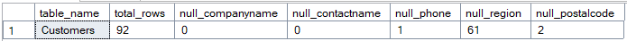
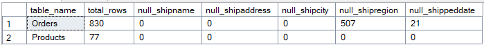
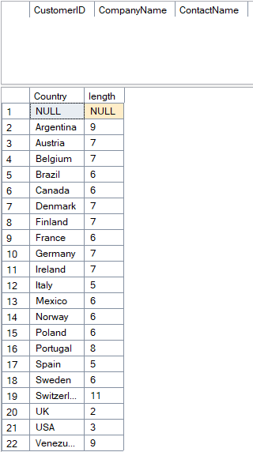
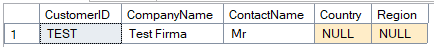
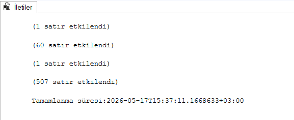
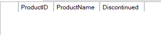
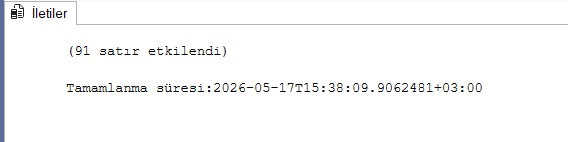
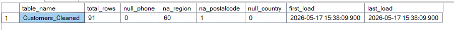

# Veri Temizleme ve ETL Süreçleri Tasarımı

Genel 4, Final 3. Proje

Ağ Tabanlı Paralel Dağıtım Sistemleri dersi için yapılan Veri Temizleme ve ETL Süreçleri Tasarımı projesi.

# BLM 4522 PROJE RAPORU 

Zeynep Hacısalihoğlu

22290449

## İçindekiler

- [1. Giriş](#1-giriş)
  - [1.1 Amaç ve Kapsam](#11-amaç-ve-kapsam)
  - [1.2 Kullanılan Ortam](#12-kullanılan-ortam)
  - [1.3 Veri Tabanı Kurulumu](#13-veri-tabanı-kurulumu)
- [2. Veri Analizi (Extract)](#2-veri-analizi-extract)
  - [2.1 NULL Değerlerin Tespiti](#21-null-değerlerin-tespiti)
  - [2.2 Tutarsız Veri Kontrolü](#22-tutarsız-veri-kontrolü)
  - [2.3 Kirli Veri Tespiti](#23-kirli-veri-tespiti)
- [3. Veri Temizleme ve Dönüştürme (Transform)](#3-veri-temizleme-ve-dönüştürme-transform)
  - [3.1 Hatalı Verilerin Temizlenmesi](#31-hatalı-verilerin-temizlenmesi)
  - [3.2 Veri Dönüştürme ve Standartlaştırma](#32-veri-dönüştürme-ve-standartlaştırma)
- [4. Veri Yükleme (Load)](#4-veri-yükleme-load)
  - [4.1 Hedef Tablonun Oluşturulması ve Veri Yüklenmesi](#41-hedef-tablonun-oluşturulması-ve-veri-yüklenmesi)
- [5. Veri Kalitesi Raporu](#5-veri-kalitesi-raporu)
  - [5.1 ETL Sonrası Veri Kalitesi Analizi](#51-etl-sonrası-veri-kalitesi-analizi)
- [6. Sonuç](#6-sonuç)


# 1.	Giriş

Bu proje kapsamında Microsoft SQL Server 2022 üzerinde çalışan Northwind veritabanında ETL (Extract, Transform, Load) süreçleri tasarlanmış ve uygulanmıştır. Veri temizleme, dönüştürme ve yükleme adımları T-SQL kullanılarak gerçekleştirilmiş; sürecin sonunda veri kalitesi raporları oluşturulmuştur.

## 1.1 Amaç ve Kapsam

Çalışmanın temel amacı Northwind veritabanındaki hatalı, eksik ve tutarsız verileri tespit ederek temizlemek, dönüştürmek ve hazırlanan veriyi hedef tablolara yüklemektir.

Bu doğrultuda aşağıdaki adımlar uygulanmıştır:

    •	Kaynak veriler analiz edilerek eksik ve tutarsız değerler tespit edilmiştir.
    •	Hatalı veriler T-SQL ile temizlenmiştir.
    •	Veriler standart formata dönüştürülmüştür.
    •	Temizlenmiş veriler hedef tabloya yüklenmiştir.
    •	Veri kalitesi raporu oluşturulmuştur.


## 1.2	Kullanılan Ortam

    •	Veritabanı Sistemi: Microsoft SQL Server 2022 Developer Edition, Sürüm 16.0.1000.6
    •	Yönetim Aracı: SQL Server Management Studio (SSMS)


## 1.3	Veri Tabanı Kurulumu

Proje kapsamında kullanılacak örnek veritabanı olarak Northwind seçilmiştir. Northwind, Microsoft tarafından yayımlanmış; bir ticaret şirketinin sipariş, ürün, müşteri ve çalışan verilerini barındıran klasik bir örnek veritabanıdır. Veritabanı SSMS üzerinden başarıyla yüklenmiş ve önceki projelerde doğrulanmıştır.

## 2. Veri Analizi (Extract)

## 2.1 NULL Değerlerin Tespiti

ETL sürecinin ilk aşamasında kaynak verilerin kalitesi analiz edilmiştir. Customers, Orders ve Products tablolarındaki NULL değerler sorgulanmıştır.

```sql
SELECT 
    'Customers' AS table_name,
    COUNT(*) AS total_rows,
    SUM(CASE WHEN CompanyName IS NULL THEN 1 ELSE 0 END) AS null_companyname,
    SUM(CASE WHEN ContactName IS NULL THEN 1 ELSE 0 END) AS null_contactname,
    SUM(CASE WHEN Phone IS NULL THEN 1 ELSE 0 END) AS null_phone,
    SUM(CASE WHEN Region IS NULL THEN 1 ELSE 0 END) AS null_region,
    SUM(CASE WHEN PostalCode IS NULL THEN 1 ELSE 0 END) AS null_postalcode
FROM Customers;
```
Customers tablosunda 1 eksik telefon, 61 eksik bölge ve 2 eksik posta kodu tespit edilmiştir.




```sql
SELECT 
    'Orders' AS table_name,
    COUNT(*) AS total_rows,
    SUM(CASE WHEN ShipName IS NULL THEN 1 ELSE 0 END) AS null_shipname,
    SUM(CASE WHEN ShipAddress IS NULL THEN 1 ELSE 0 END) AS null_shipaddress,
    SUM(CASE WHEN ShipCity IS NULL THEN 1 ELSE 0 END) AS null_shipcity,
    SUM(CASE WHEN ShipRegion IS NULL THEN 1 ELSE 0 END) AS null_shipregion,
    SUM(CASE WHEN ShippedDate IS NULL THEN 1 ELSE 0 END) AS null_shippeddate
FROM Orders

UNION ALL

SELECT 
    'Products' AS table_name,
    COUNT(*) AS total_rows,
    SUM(CASE WHEN ProductName IS NULL THEN 1 ELSE 0 END) AS null_productname,
    SUM(CASE WHEN QuantityPerUnit IS NULL THEN 1 ELSE 0 END) AS null_quantityperunit,
    SUM(CASE WHEN UnitPrice IS NULL THEN 1 ELSE 0 END) AS null_unitprice,
    SUM(CASE WHEN UnitsInStock IS NULL THEN 1 ELSE 0 END) AS null_unitsinstock,
    SUM(CASE WHEN ReorderLevel IS NULL THEN 1 ELSE 0 END) AS null_reorderlevel
FROM Products;
```

Orders tablosunda 507 eksik bölge ve 21 gönderilmemiş sipariş tespit edilmiştir. Products tablosunda NULL değer bulunmamaktadır. 



## 2.2 Tutarsız Veri Kontrolü

Fazla boşluk ve tutarsız Country değerleri kontrol edilmiştir.

```sql
SELECT CustomerID, CompanyName, ContactName
FROM Customers
WHERE CompanyName != LTRIM(RTRIM(CompanyName))
   OR ContactName != LTRIM(RTRIM(ContactName));

SELECT DISTINCT Country, LEN(Country) AS length
FROM Customers
ORDER BY Country;
```

CompanyName ve ContactName kolonlarında fazla boşluk tespit edilmemiştir. Country kolonunda NULL değer bulunduğu görülmüştür.




## 2.3 Kirli Veri Tespiti

Country değeri NULL olan kayıtlar aşağıdaki sorgu ile tespit edilmiştir.

```sql
SELECT CustomerID, CompanyName, ContactName, Country, Region
FROM Customers
WHERE Country IS NULL;
```

Sorgu sonucunda CustomerID'si "TEST" olan bir test kaydı tespit edilmiştir. Bu kaydın CompanyName, ContactName ve diğer alanları da anlamsız verilerden oluşmaktadır.



## 3. Veri Temizleme ve Dönüştürme (Transform)

## 3.1 Hatalı Verilerin Temizlenmesi

Analiz aşamasında tespit edilen hatalı ve eksik veriler aşağıdaki T-SQL komutları ile temizlenmiştir. Test kaydı silinmiş, NULL bölge ve posta kodu değerleri 'N/A' ile doldurulmuştur.

```sql
sql-- Test kaydını sil
DELETE FROM Customers WHERE CustomerID = 'TEST';

-- NULL Region değerlerini 'N/A' ile doldur
UPDATE Customers 
SET Region = 'N/A' 
WHERE Region IS NULL;

-- NULL PostalCode değerlerini 'N/A' ile doldur
UPDATE Customers
SET PostalCode = 'N/A'
WHERE PostalCode IS NULL;

-- Orders tablosundaki NULL ShipRegion değerlerini 'N/A' ile doldur
UPDATE Orders
SET ShipRegion = 'N/A'
WHERE ShipRegion IS NULL;
```

İşlem sonucunda 1 test kaydı silinmiş, 60 Region ve 1 PostalCode değeri güncellenmiş, Orders tablosunda 507 ShipRegion değeri 'N/A' olarak işaretlenmiştir. 




## 3.2 Veri Dönüştürme ve Standartlaştırma

Customers tablosundaki Country değerlerinin büyük/küçük harf tutarlılığı sağlanmış, ContactTitle kolonundaki fazla boşluklar temizlenmiştir. Ayrıca Products tablosundaki Discontinued kolonu doğrulanmıştır.

```sql
sql-- Country değerlerini standartlaştır
UPDATE Customers
SET Country = UPPER(LEFT(Country, 1)) + LOWER(SUBSTRING(Country, 2, LEN(Country)))
WHERE Country IS NOT NULL;

-- ContactTitle boşluklarını temizle
UPDATE Customers
SET ContactTitle = LTRIM(RTRIM(ContactTitle));

-- Discontinued kontrolü
SELECT ProductID, ProductName, Discontinued
FROM Products
WHERE Discontinued NOT IN (0, 1);
```

Discontinued kolonunda tutarsız değer bulunmamıştır. Country ve ContactTitle değerleri başarıyla standartlaştırılmıştır. 




## 4. Veri Yükleme (Load)

## 4.1 Hedef Tablonun Oluşturulması ve Veri Yüklenmesi

Temizlenen ve dönüştürülen veriler yeni bir hedef tabloya yüklenmiştir. Hedef tablo, kaynak tabloya ek olarak ETL yükleme tarihini de kayıt altına alan ETL_LoadDate kolonunu içermektedir.

```sql
sql-- Hedef tablo oluştur
CREATE TABLE Customers_Cleaned (
    CustomerID NCHAR(5) PRIMARY KEY,
    CompanyName NVARCHAR(40) NOT NULL,
    ContactName NVARCHAR(30),
    ContactTitle NVARCHAR(30),
    Phone NVARCHAR(24),
    Country NVARCHAR(15),
    Region NVARCHAR(15),
    PostalCode NVARCHAR(10),
    ETL_LoadDate DATETIME DEFAULT GETDATE()
);

-- Temizlenmiş veriyi yükle
INSERT INTO Customers_Cleaned 
    (CustomerID, CompanyName, ContactName, ContactTitle, Phone, Country, Region, PostalCode)
SELECT 
    CustomerID, CompanyName, ContactName, ContactTitle, Phone, Country, Region, PostalCode
FROM Customers
WHERE Country IS NOT NULL;
```


İşlem sonucunda 91 kayıt Customers_Cleaned tablosuna başarıyla yüklenmiştir.



## 5.5. Veri Kalitesi Raporu

## 5.1 ETL Sonrası Veri Kalitesi Analizi

ETL sürecinin tamamlanmasının ardından hedef tablodaki veri kalitesi sorgulanmıştır. Rapor; toplam kayıt sayısı, eksik değerler ve yükleme tarihi bilgilerini içermektedir.

```sql
SELECT 
    'Customers_Cleaned' AS table_name,
    COUNT(*) AS total_rows,
    SUM(CASE WHEN Phone IS NULL THEN 1 ELSE 0 END) AS null_phone,
    SUM(CASE WHEN Region = 'N/A' THEN 1 ELSE 0 END) AS na_region,
    SUM(CASE WHEN PostalCode = 'N/A' THEN 1 ELSE 0 END) AS na_postalcode,
    SUM(CASE WHEN Country IS NULL THEN 1 ELSE 0 END) AS null_country,
    MIN(ETL_LoadDate) AS first_load,
    MAX(ETL_LoadDate) AS last_load
FROM Customers_Cleaned;
```

Sorgu sonucunda aşağıdaki tespitler yapılmıştır:

| Metrik | Değer |
|---|---|
| Toplam kayıt | 91 |
| NULL telefon | 0 |
| N/A bölge | 60 |
| N/A posta kodu | 1 |
| NULL ülke | 0 |
| ETL yükleme tarihi | 2026-05-17 15:38 |




## 6.	Sonuç

Bu proje kapsamında Northwind veritabanında ETL (Extract, Transform, Load) süreci tasarlanmış ve uygulanmıştır. Yapılan çalışmalar sonucunda aşağıdaki iyileştirmeler sağlanmıştır:

    •	Customers, Orders ve Products tablolarındaki NULL ve tutarsız değerler analiz edilerek tespit edilmiştir.
    •	CustomerID'si "TEST" olan anlamsız test kaydı veritabanından silinmiştir.
    •	NULL bölge ve posta kodu değerleri 'N/A' ile doldurularak veri bütünlüğü sağlanmıştır.
    •	Country ve ContactTitle kolonlarındaki tutarsızlıklar standartlaştırılmıştır.
    •	Temizlenen veriler ETL yükleme tarihi bilgisiyle birlikte Customers_Cleaned hedef tablosuna yüklenmiştir.
    •	ETL sonrası veri kalitesi raporu oluşturulmuş ve NULL ülke ile NULL telefon değerlerinin tamamen giderildiği doğrulanmıştır.

Çalışma boyunca T-SQL'in veri temizleme ve dönüştürme süreçlerinde ne denli etkili bir araç olduğu görülmüştür.
