# 2. Veri tabanı Yedekleme ve Felaketten Kurtarma Planı

Ağ Tabanlı Paralel Dağıtım Sistemleri dersi için yapılan 2. Veritabanı Yedekleme ve Felaketten Kurtarma Planı projesi

# BLM 4522 PROJE RAPORU 

2. Veri tabanı Yedekleme ve Felaketten Kurtarma Planı

Zeynep Hacısalihoğlu

22290449


# 1.	Giriş
Bu proje Microsoft SQL Server üzerinde Northwind örnek veri tabanı kullanılarak kapsamlı bir yedekleme ve felaketten kurtarma planının tasarlanması ve uygulanmasını konu almaktadır. Proje boyunca tam yedekleme, fark yedekleme ve transaction log yedekleme stratejileri ele alınmış; bu yedeklerin otomatize edilmesi ve felaket senaryolarında veri kurtarma süreçleri uygulamalı olarak gerçekleştirilmiştir.

## 1.1	Kullanılan Ortam

-  Veritabanı Sistemi: Microsoft SQL Server 2022 Developer Edition, Sürüm 16.0.1000.6 
-  Yönetim Aracı: SQL Server Management Studio (SSMS) 

## 1.2	Veri Tabanı Kurulumu

Proje kapsamında kullanılacak örnek veri tabanı olarak Northwind seçilmiştir. Northwind Microsoft tarafından yayımlanmış, bir ticaret şirketinin sipariş, ürün, müşteri ve çalışan verilerini barındıran klasik bir örnek veritabanıdır. Veritabanı SSMS üzerinden başarıyla yüklenmiş ve aşağıdaki sorgu ile doğrulanmıştır:

```sql
USE Northwind;
SELECT name, database_id, create_date 
FROM sys.databases 
WHERE name = 'Northwind';
```


## 1.3 Amaç ve Planlama

Amaç: Bir felaket anında (sunucu çökmesi, yanlışlıkla silme, veri bozulması) veriyi geri getirebilmek.

1. Full Backup  => Tüm DB'nin şuanki halini kaydetmek
2. Differential Backup => Full'dan sonraki değişiklikleri yakalamak
3. Transaction Log Backup => Saatlik/dakikalık değişiklikleri yakalamak
4. Otomatik ZamanlamaBunları => SQL Agent ile otomatik çalışmasını sağlamak
5. Test aşaması => DB'yi silmek / veriyi bozmak
6. Geri Yüklemeye çalışmak


## 2. Tam Yedekleme (Full Backup)
Tam yedekleme veri tabanının tüm verilerini ve log dosyasını tek bir .bak dosyasına yazar. Diğer yedekleme türlerinin temeli olduğundan ilk adım olarak uygulanmıştır.

```sql
BACKUP DATABASE Northwind
TO DISK = 'C:\NorthwindBackups\Northwind_Full.bak'
WITH FORMAT,
     MEDIANAME = 'NorthwindBackup',
     NAME = 'Northwind Tam Yedekleme',
     STATS = 10;

```

Sonuç: Yedekleme işlemi başarıyla tamamlanmıştır. Northwind veritabanına ait 976 veri sayfası ve 1 log sayfası olmak üzere toplam 977 sayfa, 0.040 saniyede 190.661 MB/sn hızıyla C:\NorthwindBackups\Northwind_Full.bak dosyasına yazılmıştır. 


## 3. Fark Yedekleme (Differential Backup)

Fark yedekleme, son tam yedeklemeden bu yana değişen sayfaları yazar. Tam yedeğe kıyasla çok daha hızlı ve küçük boyutludur.

```sql
BACKUP DATABASE Northwind
TO DISK = 'C:\NorthwindBackups\Northwind_Diff.bak'
WITH DIFFERENTIAL,
     NAME = 'Northwind Fark Yedekleme',
     STATS = 10;
```

Sonuç: 105 sayfa (104 veri + 1 log) 0.009 saniyede işlenmiştir. Full backup'taki 977 sayfaya kıyasla yalnızca değişen sayfalar yazıldığından boyut ve süre belirgin şekilde düşmüştür. 


## 4. Transaction Log Yedekleme
Transaction log yedekleme son log yedeklemesinden bu yana gerçekleşen tüm işlemleri kaydeder. Recovery model'in FULL olduğu durumlarda kullanılabilir. Northwind veritabanının recovery model'i aşağıdaki sorguyla kontrol edilmiş ve zaten FULL olduğu doğrulanmıştır:

```sql
SELECT name, recovery_model_desc 
FROM sys.databases 
WHERE name = 'Northwind';
```


Ardından log yedekleme alınmıştır:

``` sql
BACKUP LOG Northwind
TO DISK = 'C:\NorthwindBackups\Northwind_Log.bak'
WITH NAME = 'Northwind Log Yedekleme';
```


Sonuç: Yalnızca 3 log sayfası 0.002 saniyede işlenmiştir. Bu, log yedeklemenin ne kadar hafif bir işlem olduğunu göstermektedir. 

## 5. Otomatik Yedekleme Zamanlaması (SQL Server Agent)

Manuel yedekleme almanın yanı sıra yedekleme işlemlerinin düzenli ve otomatik olarak gerçekleştirilmesi için SQL Server Agent kullanılmıştır. 

Aşağıdaki T-SQL kodu ile her gece saat 02:00'de otomatik tam yedekleme alacak bir job tanımlanmıştır:

```sql

USE msdb;

EXEC sp_add_job
    @job_name = N'Northwind Otomatik Tam Yedekleme';

EXEC sp_add_jobstep
    @job_name = N'Northwind Otomatik Tam Yedekleme',
    @step_name = N'Full Backup Al',
    @command = N'BACKUP DATABASE Northwind
TO DISK = ''C:\NorthwindBackups\Northwind_Full_Auto.bak''
WITH FORMAT, NAME = ''Northwind Otomatik Tam Yedekleme''';

EXEC sp_add_schedule
    @schedule_name = N'Her Gece Saat 02:00',
    @freq_type = 4,
    @freq_interval = 1,
    @active_start_time = 020000;

EXEC sp_attach_schedule
    @job_name = N'Northwind Otomatik Tam Yedekleme',
    @schedule_name = N'Her Gece Saat 02:00';

EXEC sp_add_jobserver
    @job_name = N'Northwind Otomatik Tam Yedekleme';

```
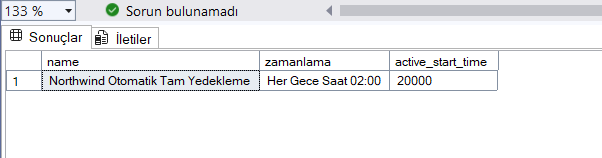


Job'ın başarıyla oluşturulduğu sorgu ile doğrulanmış, ayrıca SSMS arayüzünde SQL Server Agent → Jobs altında görüntülenmiştir.


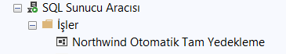

## 6. Felaket Senaryosu ve Geri Yükleme

Yedekleme süreçlerinin etkinliğini test etmek amacıyla gerçek bir veri kaybı senaryosu test edilmiştir.

Adım 1 - Test verisi oluşturuldu:

```sql

CREATE TABLE TestSatis (
    ID INT PRIMARY KEY,
    Urun NVARCHAR(50),
    Miktar INT
);
INSERT INTO TestSatis VALUES (1, 'Elma', 100);
INSERT INTO TestSatis VALUES (2, 'Armut', 200);
INSERT INTO TestSatis VALUES (3, 'Kiraz', 300);

```

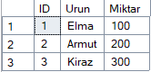

Adım 2 - Yedek alındı:

```sql

BACKUP DATABASE Northwind
TO DISK = 'C:\NorthwindBackups\Northwind_Full2.bak'
WITH FORMAT, NAME = 'Northwind Tam Yedekleme 2';

```

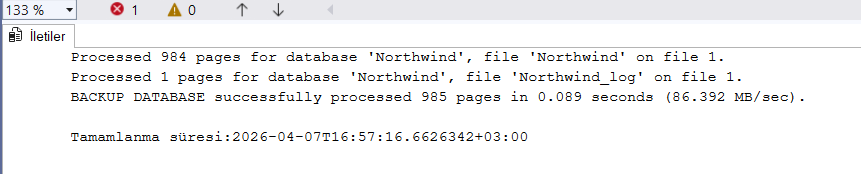


Adım 3 - Felaket simüle edildi (tablo silindi):

```sql

USE Northwind;
DROP TABLE TestSatis;

```


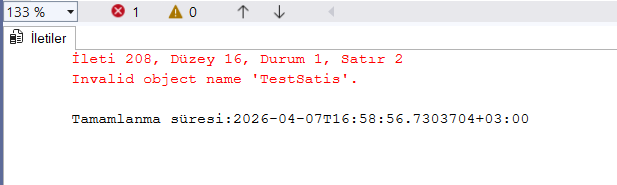


Adım 4 - Geri yükleme yapıldı:

```sql

USE master;
ALTER DATABASE Northwind SET SINGLE_USER WITH ROLLBACK IMMEDIATE;
RESTORE DATABASE Northwind
FROM DISK = 'C:\NorthwindBackups\Northwind_Full2.bak'
WITH REPLACE, RECOVERY;
ALTER DATABASE Northwind SET MULTI_USER;

```

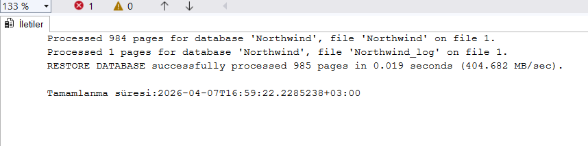


Sonuç: 985 sayfa 0.019 saniyede geri yüklenmiş TestSatis tablosu ve tüm veriler başarıyla kurtarılmıştır. 


Not: İlk geri yükleme denemesinde TestSatis tablosunun geri gelmediği gözlemlenmiştir. Bunun nedeni Full Backup'ın tablo oluşturulmadan önce alınmış olmasıdır. Bu durum, yedekleme zamanlamasının ne kadar kritik olduğunu açıkça ortaya koymaktadır.

## 7. Yedek Doğrulama (RESTORE VERIFYONLY)

Alınan yedek dosyasının gerçekten geri yüklenebilir olduğunu doğrulamak için RESTORE VERIFYONLY komutu kullanılmıştır. Bu komut yedeği geri yüklemeden sadece dosyanın bütünlüğünü kontrol eder.

```sql
RESTORE VERIFYONLY
FROM DISK = 'C:\NorthwindBackups\Northwind_Full2.bak';

```

Sonuç: "The backup set on file 1 is valid." mesajı yedek dosyasının sağlıklı ve geri yüklenmeye hazır olduğunu doğrulamaktadır. 

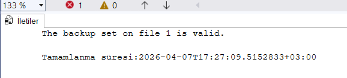


## 8. SSMS Arayüzü Üzerinden Doğrulama

Proje kapsamında T-SQL ile gerçekleştirilen tüm işlemler SSMS arayüzü üzerinden de doğrulanmıştır.

## 8.1 Yedekleme Arayüzü

SSMS üzerinden Northwind → Görevler → Yedekle ekranı açılmıştır. Kurtarma modelinin "TAM", yedek türünün "Tam" ve hedefin C:\NorthwindBackups\Northwind_Full.bak olarak ayarlı olduğu görülmektedir. 

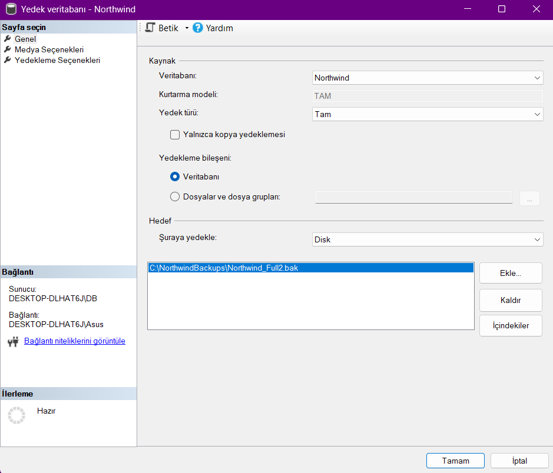

## 8.2 Job Genel Bilgileri

SQL Server Agent altında oluşturulan "Northwind Otomatik Tam Yedekleme" jobının genel özellikleri incelenmiştir. Job'ın etkin olduğu, 07.04.2026 tarihinde oluşturulduğu görülmektedir. 

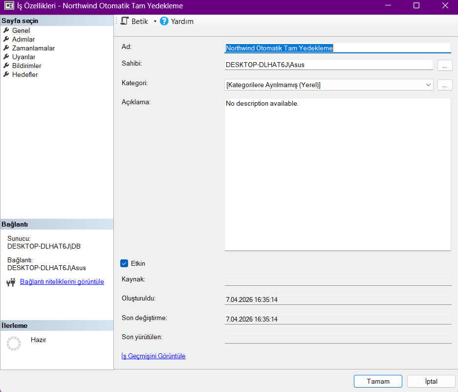

## 8.3 Job Zamanlaması

Zamanlamalar sekmesinde "Her Gece Saat 02:00" zamanlamasının aktif olduğu ve her gün saat 02:00'de çalışacak şekilde yapılandırıldığı görülmektedir. 

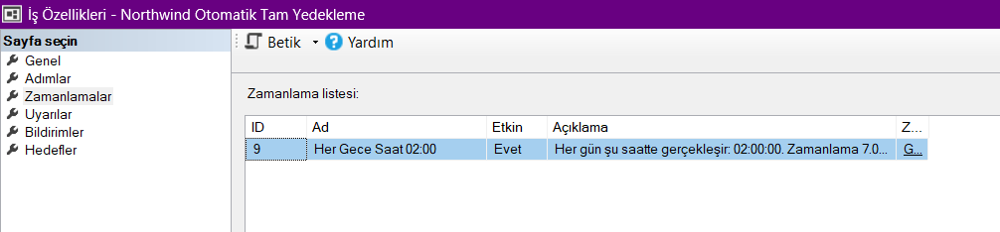


## 8.4 Job Adımları

Adımlar sekmesinde job'ın "Full Backup Al" adında bir T-SQL adımı içerdiği, başarılı olduğunda işten çıkacağı hata durumunda raporlama yapacağı görülmektedir. 

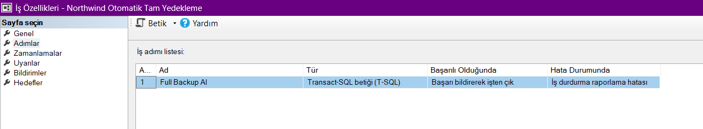

## 8.5 Recovery Model Doğrulama

Veritabanı Özellikleri → Seçenekler ekranında Northwind'in kurtarma modelinin "Tam" (Full Recovery), uyumluluk düzeyinin SQL Server 2022 olduğu doğrulanmıştır. 

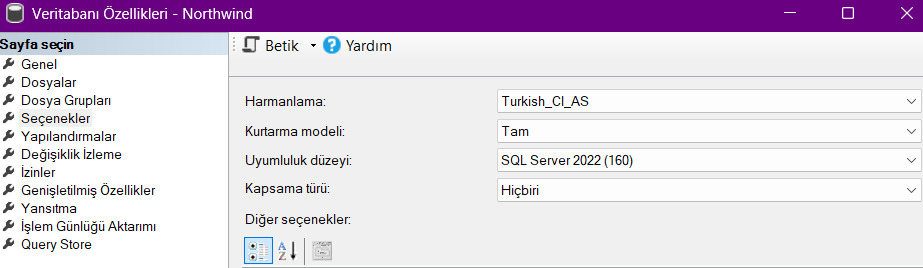

## 8.6 Yedekleme Geçmişi

Tüm yedekleme işlemlerinin sistem tablosuna kayıt düştüğü aşağıdaki sorgu ile doğrulanmıştır:


```sql
   SELECT 
    database_name,
    backup_type = CASE type 
        WHEN 'D' THEN 'Full Backup'
        WHEN 'I' THEN 'Differential Backup'
        WHEN 'L' THEN 'Log Backup'
    END,
    backup_start_date,
    backup_finish_date,
    CAST(backup_size/1024 AS INT) AS boyut_kb
FROM msdb.dbo.backupset
WHERE database_name = 'Northwind'
ORDER BY backup_start_date;
```


Sorgu çıktısında 4 yedekleme işlemi listelenmiştir: Full Backup (7888 KB), Differential Backup (912 KB), Log Backup (76 KB) ve ikinci Full Backup (7952 KB). Boyutlar arasındaki fark üç yedekleme türünün mantığını açıkça ortaya koymaktadır.

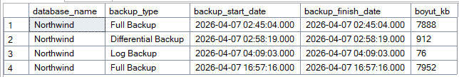


## 9. Sonuç

Bu proje kapsamında Microsoft SQL Server 2022 üzerinde çalışan Northwind veritabanı kullanılarak kapsamlı bir yedekleme ve felaketten kurtarma planı başarıyla tasarlanmış ve uygulanmıştır.

Proje boyunca üç farklı yedekleme stratejisi uygulamalı olarak gerçekleştirilmiştir. Tam yedekleme ile veritabanının tüm anlık görüntüsü alınmış, diff yedekleme ile yalnızca değişen veriler kaydedilerek zaman ve alan tasarrufu sağlanmış, transaction log yedekleme ile ise dakika bazında veri kaybının önüne geçilebileceği gösterilmiştir. Üç yöntemin boyut ve hız karşılaştırması, hangi senaryoda hangi yedekleme türünün tercih edilmesi gerektiğini somut olarak ortaya koymuştur.

SQL Server Agent kullanılarak yedekleme işlemleri otomatize edilmiş, her gece saat 02:00'de çalışacak bir job tanımlanmıştır. Bu sayede insan hatasına bağlı yedek atlama riski ortadan kaldırılmıştır.

Felaket senaryosunda bir tablonun yanlışlıkla silinmesi simüle edilmiş ve full backup kullanılarak veri başarıyla kurtarılmıştır. Bu süreçte yaşanan ilk başarısız geri yükleme denemesi, yedekleme zamanlamasının ne kadar kritik olduğunu pratikte göstermiştir.

Son olarak RESTORE VERIFYONLY komutu ile yedek dosyasının bütünlüğü doğrulanmış, tüm işlemler SSMS arayüzü üzerinden görsel olarak da teyit edilmiştir.

Bu proje bir veritabanı yöneticisinin felaket anında panik yapmak yerine önceden planlanmış bir stratejiyle hareket edebilmesinin önemini açıkça ortaya koymaktadır. Düzenli alınan ve test edilen yedekler, veri güvenliğinin temel güvencesidir.